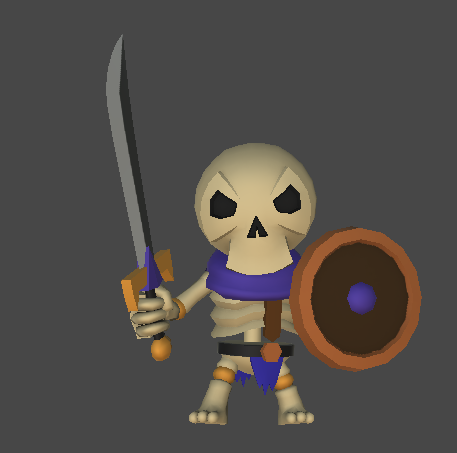
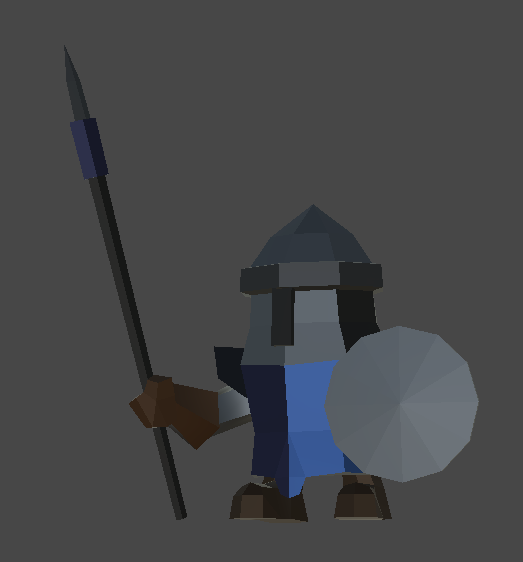
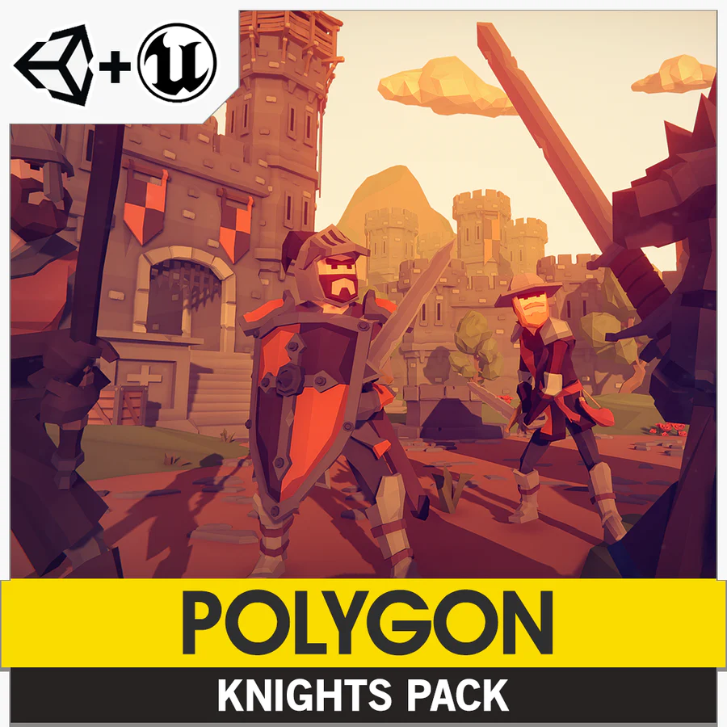
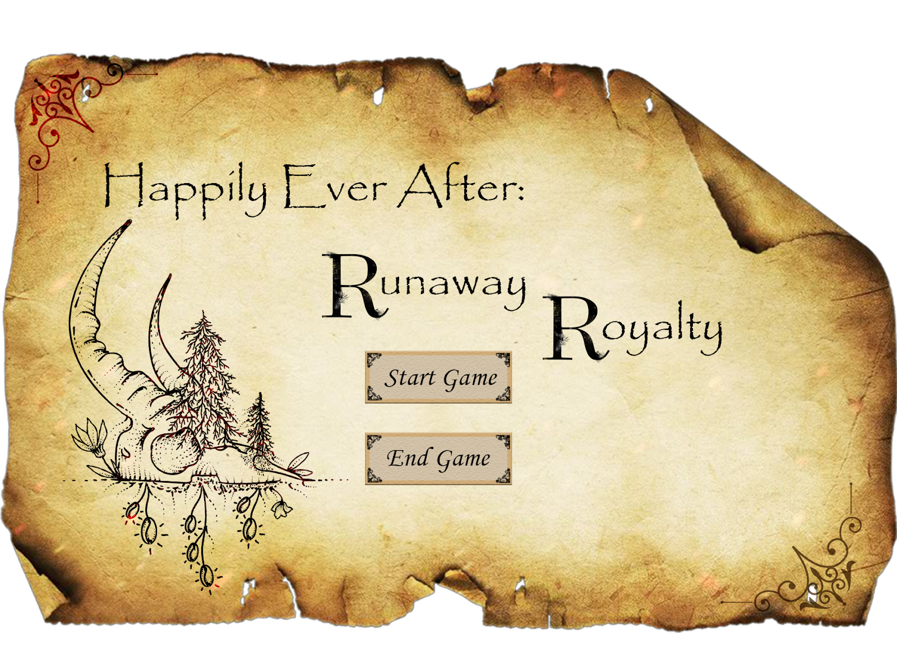

# Game Design Document (GDD)
### Table of contents
- [Game Design Document (GDD)](#game-design-document-gdd)
    - [Table of contents](#table-of-contents)
    - [Game Overview](#game-overview)
    - [Story and Narrative](#story-and-narrative)
    - [Gameplay and Mechanics](#gameplay-and-mechanics)
    - [Levels and World Design](#levels-and-world-design)
    - [Art and Audio](#art-and-audio)
    - [User Interface (UI)](#user-interface-ui)
    - [Technology and Tools](#technology-and-tools)
    - [Team Communication, Timelines and Task Assignment](#team-communication-timelines-and-task-assignment)
    - [Possible Challenges](#possible-challenges)

### Game Overview
Inspired by Unrailed, **Happily Ever After: Runaway Royalty** is a isometric 3D survival RPG targetted to 12-30 aged casual players. The core concept involves the knight (player) escorting the royal princess to the gate of happiness within 5 minutes. 

  

It's Unique Selling Points (USPs) include: 
* Multiple character classes each with unique abilities for players to choose.
* A collection of random monsters, random items, combined with multiple character classes make the game replayable.
* Players have multiple tasks, including maintaining princesses, carriage and horses, fighting monsters, cleaning or building roads, avoiding natural disasters, etc., providing high playability.
* A variety of skill items provide different ways to combat or to survive.
* The constant countdown of the five-minute timer adds tension and urgency.
* Depending on the player's choices and performance, there can be multiple endings. The princess could successfully escape, find true allies, or she might face capture and the undesirable fate that awaits her. The player can replay the game to make alternative choices and explore different endings.

### Story and Narrative
Our lovely princess married the prince of a neighbouring country. But to her surprise, the prince is a complete evil! He wants to suck the princess’s blood to gain eternal youth! Determined to escape this tragic fate, the princess flees the castle, seeking refuge in her homeland, the enchanting Happy Land. With only her dwindling wealth left, she hires a knight, the player, to be her protector and guide on this treacherous journey. 

  

During the game, the player will need to find a way to get the princess safely to her original country, Happy Land. The evil prince will send soldiers after the princess to recapture her.

The princess's happiness scale will decrease over time. The constant fear and adversity she faces during the journey are consistently eroding her spirit, reaching a point where she can no longer find solace or hope in her heart. When the princess's mood drops to zero, her despair becomes overwhelming, and she loses the will to continue. This marks the end of the game. Therefore, as the princess's guard, the player is not only obligated to maintain her physical safety but also her emotional well-being.   

  

The princess doesn’t have much money left, so the carriage she finds is very easy to break down, and the horse she finds is very lazy and is a big eater. During the journey, the player needs to keep an eye on them and fix the carriage or feed the horse in time.

The evil prince has the ability to use blood to enhance himself. Besides using the princess's blood to maintain his youth, he can also extract blood from others to heal himself.

### Gameplay and Mechanics
The game will be in the third person and top-down perspective, with a fixed camera that will follow the track of the carriage.The player is visible in the game and will only be able to move within the range of what is shown in the camera. 

The player will be able to move through the accessible parts of the map using WASD controls. The F key will be used to interact with objects, such as picking up items, entertaining the princess and feeding the horse. The player will also be able to access its inventory using the B key which can store up to nine items. By holding Right Click, players can repair certain objects and items. As for fighting mechanisms, Left Click will be the player's designated key for normal attacks. There will be no special combination of keys to press, but the game intends to have many unique objects for the player to interact with to discover new sides of the forest. 

Over time, as the carriage moves forward, the player and carriage will encounter varying obstacles, such as a barricade that must be removed before the carriage can move any further, possible incidents of natural disasters, continuous decreasing of princess happiness levels and horse energy levels, waves of monsters and knights that work to stop the player, and damage to the carriage that the player must find resources to fix. In a sense, the difficulty will increase over time by having obstacles that require more time and effort from the player and deplete their resources, which may prevent them from reaching the gate of happiness within 5 minutes. The player loses the game if their health reaches 0, if the 5 minute timer runs out, or if the princess happiness metre sustains a low level.

| Levels            | Description                                          |
| ----------------- | ---------------------------------------------------- |
| Princess mood     | Decrease when carriage stops moving / enemies nearby |
| Carriage's health | Decrease upon enemy attack                           |
| Horse energy      | Decrease overtime                                    |
| Player's health   | Decrease upon enemy attack                           |

The central element of the game is a continuously moving carriage that follows a predetermined path. Player is tasked to gather resources and clearing obstacles ahead to ensure the carriage's safe passage. There are no set rules that govern this world, except for how far the player is able to move away from the carriage, as they are limited to the space that is shown on the camera. 

There will be a virtual currency (golden coins) that the player can accumulate to purchase items/cosmetics that enhance their gameplay. The player will be able to interact with all objects in the game in order to gain items that maintain the status of the princess and horse, buff the player, and defeat obstacles. The core mechanics that make this game fun and unique is the objective to keep the princess happy and varying endings that are determined by player performance.

   
  <figcaption align = "center"><b>player interact with objects in the game world</b></figcaption>

### Levels and World Design
The game would be presented in 3D top down style. 3D assets would be used to create the game world but we are limiting the player’s movement to only x and z axis, without vertical movement or jumping. This intentional restriction on player movement serves the dual purpose of helping players focus on the game's central objective - safeguarding the princess - while simultaneously mitigating potential distractions that might arise from extensive exploration of the surrounding environment. From a technical standpoint, this approach also decreases the difficulty of constructing the game map, preempting issues such as players straying out of bounds too easily.
 
The game map will scroll horizontally as the carriage advances forward, similar to the mechanics of an endless runner game. Players' movement is confined within the fixed camera's field of view. Players will not be able to access areas that have already passed. This design choice echoes the storyline of the game - the princess and knight are fleeing the castle thus there is no point of going back. Moreover, This camera perspective also encourages players to stay near the princess carriage and focus on the main task of maintaining the princess. There will be a single level(map) for the entire game. There will be a linear track extending horizontally across the screen of which the carriage follows. Players can go off the track and explore the surrounding area to collect randomly spawned resources. In each playthrough, enemies, obstacles and resources will be spawned in different locations to ensure replayability.

  
  <figcaption align = "center"><b>concept sketch</b></figcaption>

  
  <figcaption align = "center"><b>final map in game</b></figcaption>

The dynamic movement of the surrounding scenery forces players to make decisions quickly as they navigate through the changing environment. For instance, they may find themselves confronted with the choice of engaging nearby enemies or reaching a treasure chest positioned on the far side of the map.

**Type of enemies in the game**:

| Enemy       | Description                                                                                                                                             | Behavior                                                                                                                                                                                                                                           | Image                                   |
| ----------- | ------------------------------------------------------------------------------------------------------------------------------------------------------- | -------------------------------------------------------------------------------------------------------------------------------------------------------------------------------------------------------------------------------------------------- | --------------------------------------- |
| Wolf        | There are dangerous beasts living in the forest. These highly territorial enemy wander around in the forest, and attack anyone who invade their domain. | Wolves patrol within a 15-unit radius around their spawn point. If a player or carriage is detected within its alert range, it will chase and attack them. When the target moves out of their alert range, they will return to their patrol state. |        |
| Skeleton    | Skeletons are subordinates of the Evil Prince. They are tasked with recapturing the helpless prince and bringing her back to the cursed castle.         | Randomly spawns * behind the carriage. Pursues and attacks the carriage. If a player is within its alert range, it will attack the player. It will continue to attack the carriage if the player leaves its alert range.                           |    |
| Evil Knight | Evil Knights, like the skeletons, are also dispatched by the evil prince.                                                                               | Randomly spawns behind the carriage. Follows the same attack logic as the Skeletons, but they possess higher HP, slower attack and movement speed, and a larger attack range.                                                                      |  |

*Randomly spawns: Skeletons and Evil Knights will begin to spawn 30 seconds after the game starts, giving players some time to collect resources. The total number of enemies on the field will not exceed 10 at any given time.  

**Type of objects in the game**:
Collectable objects: 
These objects will be represented as statistics. One example could be golden coins: picking up golden coins can increase the player's wealth, which will be presented as a score that appears on screen. Players may also find rare gems, valuable artefacts, or ancient scrolls in treasure chests that scatter around the map. Each collectible might have a unique effect that can trigger hidden endings.

| Collectable Items | How to obtain           | Description                                                   |
| ----------------- | ----------------------- | ------------------------------------------------------------- |
| Golden coins      | Randomly spawned in map | If collected more than 10 golden coins, trigger a rich ending |
|                   |

Consumable objects:
Occupy slots in player inventory. They can be magical potions that give buffs when used, edible items that restores health, or flowers that you can give the princess to maintain her mood scale. Since each item could have specific advantages based on the situation, and there are limited slots in the player's inventory, players need to make decisions carefully when managing their resources.

  

| Consumable Items  | How to obtain                                      | Description                    | Image                                                       |
| ----------------- | -------------------------------------------------- | ------------------------------ | ----------------------------------------------------------- |
| Flower            | Randomly spawned on ground                         | Keep the princess happy        |              |
| Carrot / mushroom | Spawned when player interacts with bush            | Increase horse energy          |  |
| Apple             | Randomly spawned when player interacts with a tree | Increase player health         |                |
| Happy Cat         | Randomly spawned on ground                         | Increase princesses' happiness |                  |
| Wood materials    | Randomly spawned when player interacts with a tree | To fix the carriage/bridge     |                 |

  

In terms of game physics, we want the experience to feel intuitive to players. Our game world follows the physics you'd see in the real world, but is not strictly confined by it. For example, the player might encounter a huge rock in the middle of the road which stops the horse from moving. But the player can use their magical ability - wings - to let the carriage fly over the obstacle. Overall, We want the world to feel responsive and engaging to explore.

| Interactive Objects          | Description                                                                                                                                                            | Image                                       |
| ---------------------------- | ---------------------------------------------------------------------------------------------------------------------------------------------------------------------- | ------------------------------------------- |
| Tree                         | Press the "F" key to interact with the tree. Apple tree would drop apple and normal trees would drop woods. Items will appear on the ground for the player to pick up. |                  |
| Collectables and consumables | Press the “F” key to pick up an item. the object will disappear from the game map and appear as an item in the player's inventory.                                     |           |
| Enemy                        | Players press the “Left Click” key to attack.                                                                                                                          |
| Obstacle                     | Prevent the player and carriage from moving forward. They can be destroyed by pressing “Left Click” key.                                                               |  |
| Princess’ carriage           | Hold the “Right Click” key to repair the carriage using wood from the player's inventory. Press the “F” key to give an item to the princess.                           |  |
| Horse                        | Press “F” key to feed the horse                                                                                                                                        |     |

### Art and Audio
Drawing inspiration from the art style of "The Legend of Zelda: Link's Awakening," the game’s visual presentation would focus on crafting an enchanting narrative experience. With the vibrant colour palette and simple and clear art style, we want the game's visuals to give a sense of wonder and playfulness, as if the players are opening the pages of a fairytale. Furthermore, the chibi-style characters resonate with the game's fairytale narrative, deepening the connection between players and the unfolding adventure.

In terms of art assets, the game will employ low poly style assets,which fosters a sense of approachability, making the game inviting to a wide range of players. The deliberately simplified shapes and textures also elevate the clarity of gameplay. Players can easily identify key elements, characters, and interactive objects, which is crucial for maintaining engagement and immersion.

Picture below is 'Pure Poly, Free Low Poly Nature Forest, Unity Asset Store'

  

Sound and Music: 
The game will incorporate immersive sounds to enhance the atmosphere and gameplay. This will include sound effects: weapon swinging, attack sounds, footsteps, eating sound, repairing sound, skill sounds, carriage and horse moving sounds, item collecting sounds etc. There will also be ambient and atmospheric sounds which involve wind and rain sounds, water flowing, birds chirping and other similar sounds to build the overall forest-like atmosphere of the game. As for music, there will be a start screen background music (BGM), default BGM, boss fight BGM, game success music, and game defeat music. Notable inspirations for the default BGM include Stardew Valley Soundtrack, The Legend of Zelda Breath of the Wind OST, and Animal Crossing New Leafs The Roost. 

These soundtracks promote exploration of the natural elements of the map which is essential for the players to gather items and materials to complete the game successfully. As the game is set in mediaeval times, the music and sound will reflect the cultural and historical context of these times. With the use of the diverse sound effects, the player experience will be enhanced such that the player will feel immersed in the gameplay. The BGM will also increase in tempo as the game crawls closer to the end, to create a more tense and rushed feeling. There is also consideration for voiceovers for the princess and evil prince which will contribute to the storytelling and character development. 

Assets:

| Asset Description                                | Source                                                                                                                                                                                                                                                                                                 | Preview                                                                                                                                                                                                  |
| ------------------------------------------------ | ------------------------------------------------------------------------------------------------------------------------------------------------------------------------------------------------------------------------------------------------------------------------------------------------------ | -------------------------------------------------------------------------------------------------------------------------------------------------------------------------------------------------------- |
| Natural environment, trees, plants and rocks     | https://assetstore.unity.com/packages/3d/environments/landscapes/free-low-poly-nature-forest-205742#content                                                                                                                                                                                            | 
  
                                                                                                                                        |
| Environment, roads                               | https://assetstore.unity.com/packages/3d/environments/landscapes/rpg-poly-pack-lite-148410                                                                                                                                                                                                             | 
  
                                                                                                                                        |
| More trees                                       | https://assetstore.unity.com/packages/3d/environments/landscapes/low-poly-simple-nature-pack-162153#content                                                                                                                                                                                            | 
  
                                                                                                                                        |
| Wood props                                       | https://assetstore.unity.com/packages/3d/props/low-poly-simple-medieval-props-258397                                                                                                                                                                                                                   | 
  
                                                                                                                                        |
| Castle, town, warriors, royal family             | https://syntystore.com/products/polygon-knights-pack                                                                                                                                                                                                                                                   | 
  
                                                                                                                                        |
| Player                                           | https://assetstore.unity.com/packages/3d/characters/humanoids/rpg-tiny-hero-duo-pbr-polyart-225148                                                                                                                                                                                                     | 
  
                                                                                                                                        |
| Treasure chest, Rock, Coin, Ruby, Flowers, Coins | https://assetstore.unity.com/packages/3d/environments/fantasy/stones-and-buried-treasure-95557#content https://assetstore.unity.com/packages/3d/vegetation/low-poly-mushrooms-pack-205460 https://assetstore.unity.com/packages/3d/vegetation/plants/lowpoly-flowers-47083                             | 
  
 
  
 
  
    |
| Monsters                                         | https://assetstore.unity.com/packages/3d/characters/creatures/rpg-monster-duo-pbr-polyart-157762 https://assetstore.unity.com/packages/3d/characters/creatures/rpg-monster-buddy-pbr-polyart-253961 https://assetstore.unity.com/packages/3d/characters/creatures/party-monster-duo-polyart-pbr-195698 | 
  
 
  
 
  
 |

### User Interface (UI)
The game's UI draws inspiration from ‘nine parchments’, using a fantasy or medieval theme and integrating intricate borders, fonts related to medieval times, and elements of aged parchment.
 
Health Bars: NPC characters, including the princess's happiness and the horse's energy, will have their respective health bars displayed atop them. Meanwhile, the player's health bar will be prominently showcased in a larger format on the upper left corner of the screen.

Score Displays: Positioned just below the player's health bar, the UI will feature icons representing each collectible item, accompanied by a numerical value indicating the quantity of each item that the player has gathered.

  

  

Main Screen: The main screen will prominently display the game's title, accompanied by essential functional buttons such as "Start Game" and "End Game."

  

Inventory: Store consumable objects

  

  

### Technology and Tools
For the environment design, we'll use Procreate for initial sketches drawn on a digital panel. Once the draft is complete, we'll use Photoshop to refine the design, add details, and ensure a polished and professional look. This combination of Procreate and Photoshop allows for a flexible and efficient creative process, ultimately enhancing the visual quality of our game's environment.

After completing the initial draft, we will utilise Maya to construct some foundational 3D models. Maya stands out as our preferred option due to the familiarity of some team members with its tools and features. Moreover, Unity enables direct model export from Maya, which is convenient for implementing changes to the model within our game development process.

Considering the sound effects of the game, we opted for the straightforward capabilities of Audacity for sound editing after discussions. Although Audacity offers basic editing features in contrast to more complex software like Audition or Reaper, it serves our needs adequately for essential sound modifications.

For our UI design, we will also use Photoshop as our tool of choice. It facilitates a smooth implementation process by utilising distinct layers, enabling effective management of colours and layout. Additionally, we'll begin with a flexible wireframe to create the initial draft, which allows us to make changes if necessary during the development.

After completing the fundamental model in Maya, along with UV Mapping, we'll use Substance Painter to apply textures and colours. This software is well-suited for creating textures and diverse materials, enhancing the visual quality of our game assets.

The main software we use is Unity, where we consolidate all elements — models, textures, and sounds. In Unity, we will code essential game functions, including NPC interactions and so on. Furthermore, we also employ Unity for rigorous testing, enabling early playtesting for valuable user feedback.

### Team Communication, Timelines and Task Assignment
To enhance team collaboration and project supervision, we will use additional software tools like GoogleDoc, GitHub, and Zoom. We will use GoogleDoc to outline weekly tasks and monitor individual progress. Zoom would be used as an alternative tool for our meeting. Additionally, we utilise GitHub for version control, simplifying the process of document sharing and collaboration among team members. These tools collectively streamline our project management and document sharing workflows.

The strategies we will use to avoid merge conflicts is to use feature branches, ensure everyone pulls the latest changes and pushes changes often, conduct code reviews regularly and notify everyone in the team that there has been a change in the code. 

### Possible Challenges
This is the first time for our team to create an isometric 3D game that involves intricate rendering, perspective, and mechanics. Our team plans to address this by dedicating extra time to research and prototyping, ensuring we thoroughly understand isometric design principles and technical implementation before committing to the final build.

Creating a complete RPG game in one semester is challenging for the whole group, this may result in scope creep, which could extend development time beyond our initial estimates. As a result, we'll regularly review our project plan, reassessing feature priorities and considering the feasibility of new ideas. Meanwhile, prototyping and user testing will also be helpful for us to make informed decisions about what to include in the final release.

Effective communication is essential to avoid misunderstandings and keep everyone on the same page. In order to achieve this, we'll maintain regular team meetings, share progress updates, and encourage open communication, ensuring that any issues or questions are addressed promptly.

Receiving and integrating user feedback can be overwhelming if not managed properly. As a result, we'll create different milestone periods for user testing, carefully analysing feedback and prioritising changes based on their impact on the overall experience.
